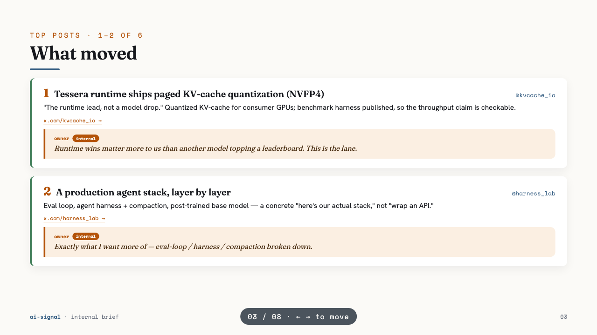

# bird-clawd — a read-only daily AI-signal screening pipeline

A Claude Code plugin that scaffolds a **local, unattended, read-only** pipeline to screen
X/Twitter for the genuine, most important AI/LLM developments — production depth, source over
opinion, no slop. **[birdclaw](https://github.com/steipete/birdclaw) + [bird](https://www.npmjs.com/package/@steipete/bird)
are the data layer; headless Claude is the brain.** It screens; it never posts.

> Built because the X "For You" feed is ~90% engagement-bait, and the genuinely important
> AI/LLM work (inference, evals, agent harnesses, real benchmarks) gets buried. This turns your
> own logged-in session into a daily, screened brief — without you doomscrolling, and without
> anything ever being posted on your behalf.



_Example team slide (fictional data). Your personal digest is plain markdown; this
self-contained HTML deck is the T+1 team view, with your comments quoted as callouts._

## What you get
Two deliverables a day:
- **`digests/<today>.md`** — a short, ranked markdown brief for *you* (top posts, ≤3 long reads,
  suggested follows), screened against a `taste.md` you control.
- **`slides/<yesterday>.html`** — a single self-contained HTML deck for a *team*, wrapping
  yesterday's digest with your own commentary as quote bubbles (T+1, so you have a day to comment).

It runs itself: **morning** (default 07:00) screens today + builds yesterday's slide; **evening**
(17:30) reviews your activity and leaves a comment slot. Your comments next morning both **tune
the screening taste** and **get quoted in the team slide**. State lives in plain files, so it
doesn't drift into one ballooning context.

## How it works
- **Data layer:** `birdclaw` (local SQLite + sync) and `bird` (reads your X session cookies over
  graphql). Beyond your follows, the morning run can use `bird search`, `bird news` (X's AI
  Explore), and `bird list-timeline` (read a curated List without following) — plus web search.
- **Brain:** headless `claude -p` does the opinionated screening, the digest, the taste-tuning,
  and the slide — guided by your `taste.md` and the bundled prompts.
- **Scheduler:** macOS `launchd` (no terminal stays open).
- **Slides:** generated via [frontend-slides](https://github.com/zarazhangrui/frontend-slides),
  locked to a brand palette you set in `brand/tokens.css`.

## Privacy & security (read this)
- **Read-only, enforced.** `.claude/settings.json` allows only `bird` *read* commands and **blocks
  every write** — tweet, reply, follow, unfollow, unbookmark. The pipeline **cannot** post,
  follow, or like, regardless of what any prompt says.
- **Local.** It reads your X session **cookies on your machine** via `bird`. Your SQLite, digests,
  and slides stay local. The only things that leave your machine are the **web searches** Claude
  runs and the **Claude API calls** that do the screening. **No data is sent to this repo's author.**
- **No paid API.** Uses your logged-in browser session, not the paid X developer API.
- You stay in control: you log into X yourself, you choose what's in `taste.md`, you read the output.

## Install
```
/plugin marketplace add https://github.com/kitchen-engineer42/bird-clawd
/plugin install ai-signal-pipeline@bird-clawd
```
Then run the skill and follow it — it installs prerequisites, connects X read-only, scaffolds your
project, tests it, and schedules it:
```
/ai-signal-pipeline
```
Requirements: macOS, Homebrew, Node, Claude Code. See [`examples/`](examples/) for what the digest
and team slide look like (fictional sample data).

## Credits
Built on three MIT-licensed projects, installed (not redistributed) by the skill:
- **birdclaw** — github.com/steipete/birdclaw
- **bird** — npm `@steipete/bird`
- **frontend-slides** — github.com/zarazhangrui/frontend-slides

MIT licensed. Author: [kitchen-engineer42](https://github.com/kitchen-engineer42).
